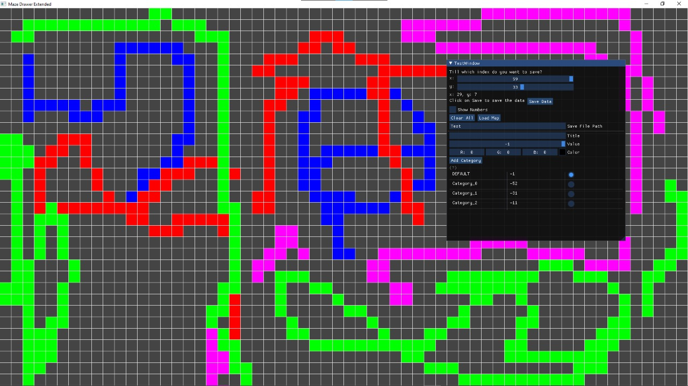
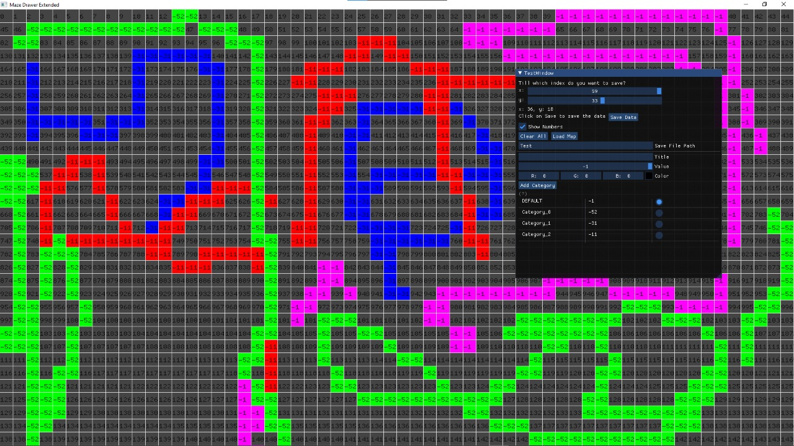

# Maze Drawing Tool
The master branch compiles and runs on Linux distributions and Windows. (OSX not tested on)

## To run the project

+ For Linux: 
    - run `make`
    - It will generate the binary file in `./Build/Sim`, _Sim_ being the binary file name.
+ For Windows:
    - run `.\premake5.exe vs2022` or `.\premake5.exe vs2019` according to your latest Visual Studio version.
    - It will generate the Visual Studio solution with the libraries and the data linked and ready to be built.
    - Run the project.
    
### If you have any problems
  If you have any problems, or want to add any more features, please contact me on [seif_sallam@aucegypt.edu](mailto:seif_sallam@aucegypt.edu).

## Images

### You can add differnet categories

 

### You can also show the numbers in each category

